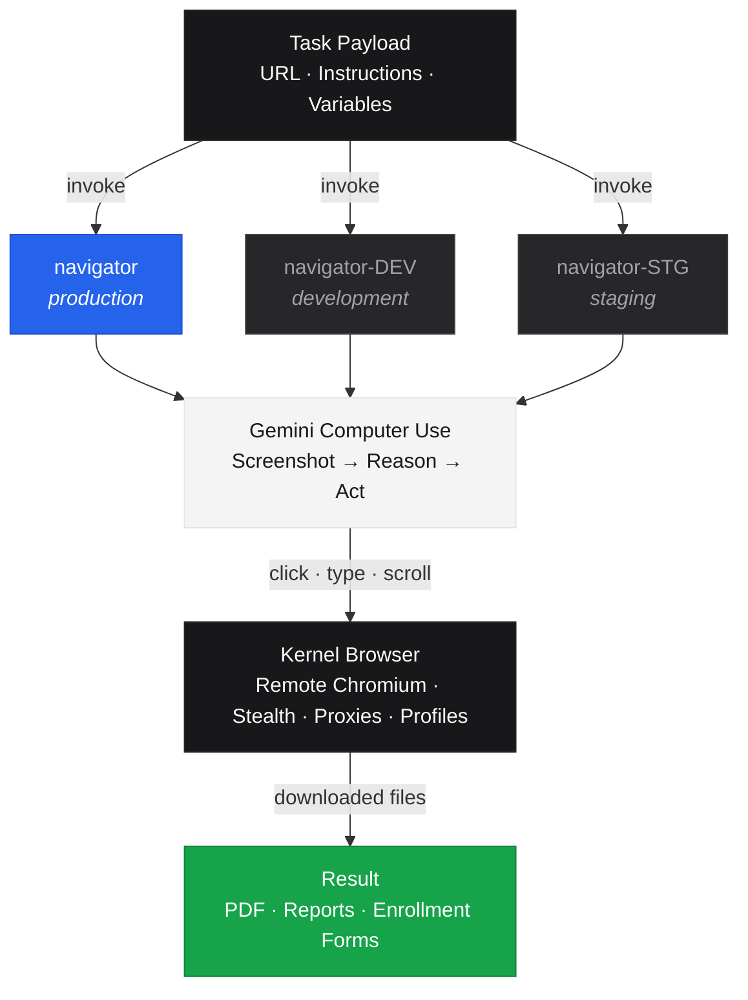

# Browser Automation with Computer Use Agent (CUA)

Multiple Kernel applications for intelligent browser automation. Each app uses a different approach to control the browser.

## Apps

| App | Kernel Name | Approach | Purpose |
|-----|-------------|----------|---------|
| **navigator** | `navigator` | Vision-based via Computer Controls | Production |
| **navigator-dev** | `navigator-DEV` | Vision-based via Computer Controls | Development (experiment here) |
| **navigator-stg** | `navigator-STG` | Vision-based via Computer Controls | Staging (validate before prod) |

### Promotion workflow

`navigator-dev` → `navigator-stg` → `navigator` (prod). Each is a full independent copy so changes can be validated at each stage before promotion.

## Project Structure

```
├── apps/                   # Kernel apps (npm workspaces)
│   ├── package.json        # Workspace root
│   ├── tsconfig.json       # TypeScript config
│   ├── node_modules/       # Shared dependencies
│   ├── navigator/          # Computer Controls API (production)
│   ├── navigator-dev/      # Computer Controls API (dev, full copy)
│   ├── navigator-stg/      # Computer Controls API (staging, full copy)
│   └── shared/
│       ├── credentials/    # 1Password credential configs
│       │   ├── carriers/   # Insurance carriers (17)
│       │   └── benadmin/   # BenAdmin platforms (3)
│       ├── tools/          # Common tool type definitions
│       └── payloads/       # Shared payloads & master prompt
├── web/                    # Development UI (separate)
│   ├── package.json
│   └── node_modules/
├── deploy.sh               # Deployment script
└── .env                    # API keys
```

## Setup

```bash
# Install app dependencies
cd apps && npm install

# Install web UI dependencies (separate)
cd web && npm install

# Configure environment
cp .env-example .env
# Add: KERNEL_API_KEY, GOOGLE_API_KEY, OP_SERVICE_ACCOUNT_TOKEN
```

## Deploy

```bash
./deploy.sh              # Deploy all prod apps
./deploy.sh navigator    # Deploy only navigator (prod)
./deploy.sh navigator-dev # Deploy only navigator DEV
./deploy.sh navigator-stg # Deploy only navigator STG
```

## Invoke

```bash
# Navigator (prod)
kernel invoke navigator navigate-task --payload '{"url": "https://example.com", "instruction": "..."}'

# Navigator DEV
kernel invoke navigator-DEV navigate-task --payload '{"url": "https://example.com", "instruction": "..."}'

# Navigator STG
kernel invoke navigator-STG navigate-task --payload '{"url": "https://example.com", "instruction": "..."}'
```

## Local Development

```bash
# Run apps locally (from repo root)
npx --prefix apps tsx apps/navigator/index.ts
npx --prefix apps tsx apps/navigator-dev/index.ts
npx --prefix apps tsx apps/navigator-stg/index.ts

# Web UI
cd web && node server.js
# Open http://localhost:3001
```

## Architecture



## Documentation

- [Apps & Payloads Guide](apps/README.md) - App details, payload structure, and writing instructions
- [Web UI Guide](web/README.md) - Development interface
- [Kernel Docs](https://www.kernel.sh/docs) - Platform docs
- [Computer Controls API](https://www.kernel.sh/docs/browsers/computer-controls) - Navigator API
