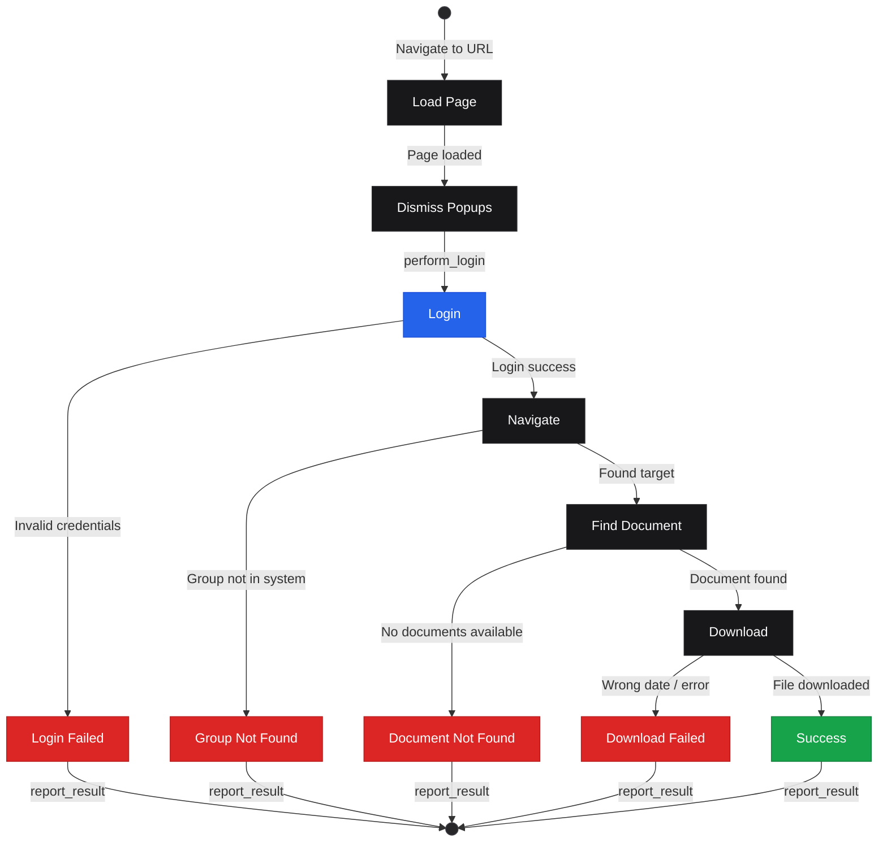
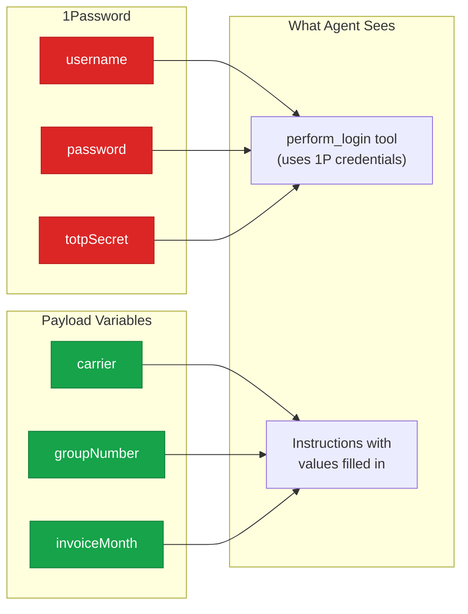

# Kernel Apps & Payloads

This directory contains Kernel browser automation apps and their payloads.

## Directory Structure

Each app is self-contained with its own code, tools, and payloads:

```
apps/
├── navigator/           # Computer Controls API/vision-based automation (production)
│   ├── index.ts         # Main app entry point
│   ├── loop.ts          # Gemini sampling loop
│   ├── session.ts       # Kernel browser session management
│   ├── tools/           # Navigator-specific tools (perform_login, etc.)
│   ├── types.ts         # TypeScript types
│   └── payloads/        # Navigator payloads
├── navigator-dev/       # Navigator (dev environment, full copy)
│   └── payloads/        # Dev-specific payloads
├── navigator-stg/       # Navigator (staging environment, full copy)
│   └── payloads/        # Staging-specific payloads
└── shared/              # Shared utilities and configs
    ├── credentials/     # Credential configs (1Password references)
    │   ├── carriers/    # Insurance carrier credentials
    │   └── benadmin/    # BenAdmin credentials
    ├── tools/
    │   └── types.ts     # Common tool type definitions
    └── payloads/        # Shared payloads (available to all apps)
```

When using the web interface, the payload list automatically updates when you switch between apps.

## Payloads

Payloads define what the browser automation agent should do. Each JSON file contains the target URL, step-by-step instructions (AOP), task parameters, and configuration options. Credentials are managed separately in 1Password.

## Task Execution Flow



## Payload Structure

```json
{
  "instruction": "# Goal\n\nYour instructions here...\n\n# Best Practices\n\n...",
  "maxSteps": 60,
  "variables": {
    "carrier": "KaiserPermanente",
    "groupNumber": "12345",
    "clientName": "Acme Corp",
    "invoiceMonth": "January",
    "invoiceYear": "2026"
  }
}
```

## Fields

### Required Fields

| Field | Type | Description |
|-------|------|-------------|
| `instruction` | string | Natural language instructions for the agent (AOP). Omit to use the default master prompt. |
| `maxSteps` | number | Maximum agent actions before timeout (typically 30-60) |

### URL Resolution

The `url` field is optional in payloads. URLs are resolved in this order:
1. **Payload `url`** — if set, takes precedence (use to override the default)
2. **Credential config** — from `shared/credentials/` (the default for each provider)

### Variables (Task Parameters)

The `variables` object contains task-specific parameters that get substituted into instructions:



**Credentials** are managed in 1Password via provider configs in `shared/credentials/`. At runtime, `op://` references are resolved to actual values by the 1Password SDK. The model never sees credential values — it calls the `perform_login` tool and provides screen coordinates (where the fields are), then the system types the actual credentials via Computer Controls.

**Credential precedence** (highest to lowest):
1. **Playground UI** — values entered in the Credentials section override everything
2. **Payload file** — `username`/`password`/`totpSecret` in `variables` override 1Password
3. **1Password** — default from provider config (`shared/credentials/`)

**Task Parameters** (substituted into instructions):
- Any key like `carrier`, `groupNumber`, `clientName`, `invoiceMonth`, `invoiceYear`
- Referenced in instructions as `%variableName%`
- Automatically replaced before sending to agent

### Optional Fields

| Field | Type | Description |
|-------|------|-------------|
| `proxyType` | string | `mobile`, `residential`, `isp`, or `datacenter` |
| `proxyCountry` | string | ISO country code (e.g., `US`, `GB`) |
| `profileName` | string | Browser profile for persistent sessions |
| `model` | string | Override Gemini model (default: `gemini-2.5-computer-use-preview-10-2025`) |

## Writing Instructions

Instructions are natural language directions for the CUA agent. Write them as clear, numbered steps.

### Best Practices

1. **Be explicit**: Name exact buttons, tabs, and fields
2. **Handle edge cases**: What to do if something isn't found
3. **Include fallbacks**: Alternative approaches if primary fails
4. **Warn about pitfalls**: Things that look clickable but aren't
5. **Set clear success criteria**: How to verify task completed

### Example Instruction

Instructions follow four standard sections: `# Goal`, `# Best Practices`, `# Deliverable`, and `# Common Errors`.

```
# Goal

You are at the portal for carrier **%carrier%**.

1. Locate the group client **%clientName%** (Group Number: **%groupNumber%**)
2. Find and download the invoice for **%invoiceMonth% %invoiceYear%**

# Best Practices

- Navigate to Billing & Payment in the main menu
- The group list may take time to load — wait for it to fully populate
- Search for the group by number or name
- CRITICAL: Verify the invoice date matches EXACTLY before downloading
- Dismiss popups/banners but don't get stuck — after 2-3 attempts, proceed

# Deliverable

A downloaded invoice PDF matching the requested group and date.

- Always verify the downloaded document matches the requested date before reporting success

# Common Errors

- The exact invoice date is not available
- The downloaded document does not match the requested date
- The login fails
- The group is not found
```

## Variable Substitution

Variables are substituted into instructions before the agent sees them:

**Payload**:
```json
{
  "instruction": "Find Group ID %groupNumber% and download %invoiceMonth% invoice",
  "variables": {
    "carrier": "KaiserPermanente",
    "groupNumber": "12345",
    "invoiceMonth": "November"
  }
}
```

**Agent sees**:
```
Find Group ID 12345 and download November invoice
```

## Proxy Configuration

For sites with bot detection, use proxies:

```json
{
  "proxyType": "residential",
  "proxyCountry": "US"
}
```

**Proxy types** (best to worst for avoiding detection):
1. `mobile` - Mobile carrier IPs (best)
2. `residential` - Home ISP IPs (good)
3. `isp` - Static residential IPs (moderate)
4. `datacenter` - Cloud/server IPs (basic)

## Browser Profiles

Persist cookies and session data across runs:

```json
{
  "profileName": "kaiser-session"
}
```

Benefits:
- Skip repeated logins if session persists
- Avoid "new device" detection
- Maintain any site preferences

## Naming Convention

Payload files follow this pattern:
```
{carrier}_{action}.json
```

Examples:
- `kaiser_download_invoice.json` - Kaiser Permanente invoice download
- `uhc_download_invoice.json` - UHC invoice download
- `ease_download_enrollment.json` - Ease enrollment form download
- `rippling_download_enrollment.json` - Rippling enrollment form download

## Testing Payloads

### Via CLI
```bash
# Navigator app (Computer Controls API)
kernel invoke navigator navigate-task --payload-file apps/navigator/payloads/my_task.json

# Navigator DEV
kernel invoke navigator-DEV navigate-task --payload-file apps/navigator-dev/payloads/my_task.json
```

### Via Web UI
1. Start the web server: `cd web && node server.js`
2. Open http://localhost:3001
3. Select the environment (navigator, navigator-dev, navigator-stg) in the header
4. Select your payload from the list
5. Click "Run" and watch the live view

## Debugging Tips

1. **Watch the recording**: Every run is recorded for replay
2. **Check the logs**: Look for `[perform_login]` and `[report_result]` messages
3. **Use maxSteps wisely**: Too low = task incomplete, too high = runaway agent
4. **Test incrementally**: Start with just login, then add navigation, then download
