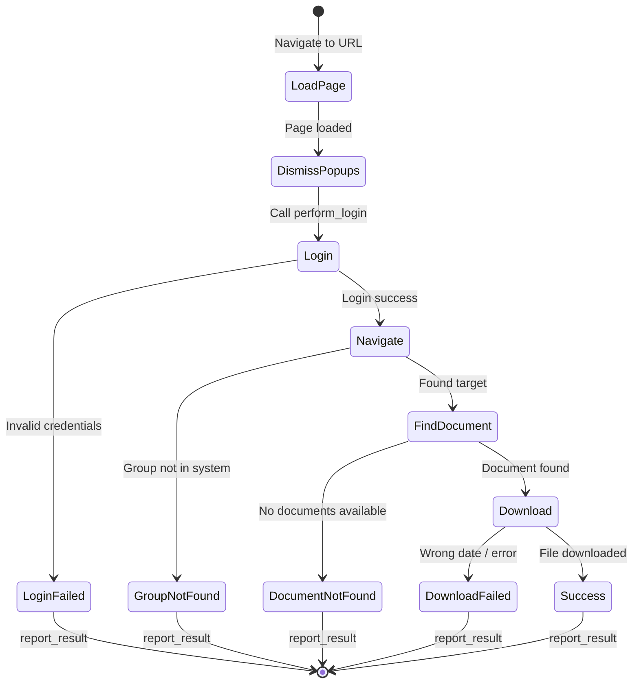
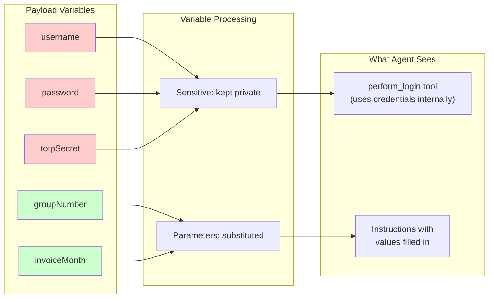

# Kernel Apps & Payloads

This directory contains Kernel browser automation apps and their payloads.

## Directory Structure

Each app is self-contained with its own code, tools, and payloads:

```
apps/
├── driver/              # Stagehand/DOM-based automation
│   ├── index.ts         # Main app entry point
│   ├── tools.ts         # Driver-specific tools
│   ├── types.ts         # TypeScript types
│   └── payloads/        # Driver payloads
│       ├── kp_invoice_test.json
│       └── uhc_invoice_test.json
├── navigator/           # Computer Controls API/vision-based automation
│   ├── index.ts         # Main app entry point
│   ├── tools.ts         # Navigator-specific tools (perform_login, etc.)
│   ├── types.ts         # TypeScript types
│   └── payloads/        # Navigator payloads
│       └── guardian_login_test.json
└── shared/              # Shared utilities and types
    └── tools/
        └── types.ts     # Common tool type definitions
```

When using the web interface, the payload list automatically updates when you switch between apps.

## Payloads

Payloads define what the browser automation agent should do. Each JSON file contains the target URL, step-by-step instructions, credentials, and configuration options.

## Task Execution Flow



## Payload Structure

```json
{
  "url": "https://example.com/login",
  "instruction": "Step-by-step instructions for the agent...",
  "maxSteps": 50,
  "variables": {
    "username": "user@example.com",
    "password": "secret123",
    "totpSecret": "ABCD1234...",
    "groupNumber": "12345",
    "invoiceMonth": "November",
    "invoiceYear": "2025"
  },
  "proxyType": "residential",
  "proxyCountry": "US",
  "profileName": "my-session"
}
```

## Fields

### Required Fields

| Field | Type | Description |
|-------|------|-------------|
| `url` | string | Starting URL for the browser |
| `instruction` | string | Natural language instructions for the agent |
| `maxSteps` | number | Maximum agent actions before timeout (typically 30-50) |

### Variables (Credentials & Parameters)

The `variables` object contains both credentials and task-specific parameters:



**Credentials** (never sent to LLM):
- `username` - Login username/email
- `password` - Login password
- `totpSecret` - TOTP secret for 2FA (base32 encoded)
- `email2faProvider` - Provider name for email-based 2FA

**Task Parameters** (substituted into instructions):
- Any other key like `groupNumber`, `invoiceMonth`, `invoiceYear`
- Referenced in instructions as `%variableName%`
- Automatically replaced before sending to agent

### Optional Fields

| Field | Type | Description |
|-------|------|-------------|
| `proxyType` | string | `mobile`, `residential`, `isp`, or `datacenter` |
| `proxyCountry` | string | ISO country code (e.g., `US`, `GB`) |
| `profileName` | string | Browser profile for persistent sessions |
| `model` | string | Override Stagehand model |
| `agentModel` | string | Override CUA agent model |
| `systemPrompt` | string | Override agent system prompt |

## Writing Instructions

Instructions are natural language directions for the CUA agent. Write them as clear, numbered steps.

### Best Practices

1. **Be explicit**: Name exact buttons, tabs, and fields
2. **Handle edge cases**: What to do if something isn't found
3. **Include fallbacks**: Alternative approaches if primary fails
4. **Warn about pitfalls**: Things that look clickable but aren't
5. **Set clear success criteria**: How to verify task completed

### Example Instruction

```
OBJECTIVE: Download the %invoiceMonth% %invoiceYear% invoice for Group ID %groupNumber%.

STEP 0 - DISMISS COOKIE BANNER (AFTER PAGE LOADS):
Once the login page has loaded, BEFORE attempting login:
1. Look for a cookie consent banner at the bottom of the page
2. Try clicking 'Accept All' button to dismiss it
3. IF clicking doesn't work after 2 attempts, press Escape and proceed

STEP 1 - LOGIN:
Call perform_login tool. If it returns success=false, immediately call report_result with status 'login_failed'.

STEP 2 - NAVIGATE TO BILLING:
1. Click on "Billing & Payment" in the navigation menu
2. Wait for the billing page to load

STEP 3 - FIND AND DOWNLOAD INVOICE:
1. Look for the %invoiceMonth% %invoiceYear% invoice
2. CRITICAL: Verify the date matches EXACTLY before downloading
3. Click the PDF icon to download

STEP 4 - REPORT RESULT:
Call report_result with:
- 'success' + filename if downloaded correctly
- 'download_failed' if date doesn't match (list available dates)

CRITICAL RULES:
- Dismiss popups/banners but don't get stuck - after 2-3 attempts, proceed
- Wait for pages to load before interacting
```

## Variable Substitution

Non-sensitive variables are substituted into instructions before the agent sees them:

**Payload**:
```json
{
  "instruction": "Find Group ID %groupNumber% and download %invoiceMonth% invoice",
  "variables": {
    "username": "user@example.com",
    "password": "secret",
    "groupNumber": "12345",
    "invoiceMonth": "November"
  }
}
```

**Agent sees**:
```
Find Group ID 12345 and download November invoice
```

Note: `username`, `password`, and `totpSecret` are NEVER substituted or sent to the LLM.

## Proxy Configuration

For sites with bot detection, use proxies:

```json
{
  "proxyType": "residential",
  "proxyCountry": "US"
}
```

**Proxy types** (best to worst for avoiding detection):
1. `mobile` - Mobile carrier IPs (best)
2. `residential` - Home ISP IPs (good)
3. `isp` - Static residential IPs (moderate)
4. `datacenter` - Cloud/server IPs (basic)

## Browser Profiles

Persist cookies and session data across runs:

```json
{
  "profileName": "kaiser-session"
}
```

Benefits:
- Skip repeated logins if session persists
- Avoid "new device" detection
- Maintain any site preferences

## Naming Convention

Payload files follow this pattern:
```
{site}_{task}_{variant}.json
```

Examples:
- `kp_invoice_test.json` - Kaiser Permanente invoice download (test)
- `uhc_invoice_bad_login.json` - UHC with intentionally wrong credentials
- `guardian_invoice_test.json` - Guardian invoice download

## Testing Payloads

### Via CLI
```bash
# Driver app (Stagehand-based)
kernel invoke driver download-task --payload-file apps/driver/payloads/my_task.json

# Navigator app (Computer Controls API)
kernel invoke navigator navigate-task --payload-file apps/navigator/payloads/my_task.json
```

### Via Web UI
1. Start the web server: `cd web && node server.js`
2. Open http://localhost:3001
3. Select the app (Driver or Navigator) in the header dropdown
4. Select your payload from the list
5. Click "Run" and watch the live view

## Debugging Tips

1. **Watch the recording**: Every run is recorded for replay
2. **Check the logs**: Look for `[perform_login]` and `[report_result]` messages
3. **Use maxSteps wisely**: Too low = task incomplete, too high = runaway agent
4. **Test incrementally**: Start with just login, then add navigation, then download
