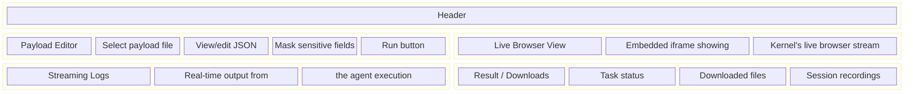
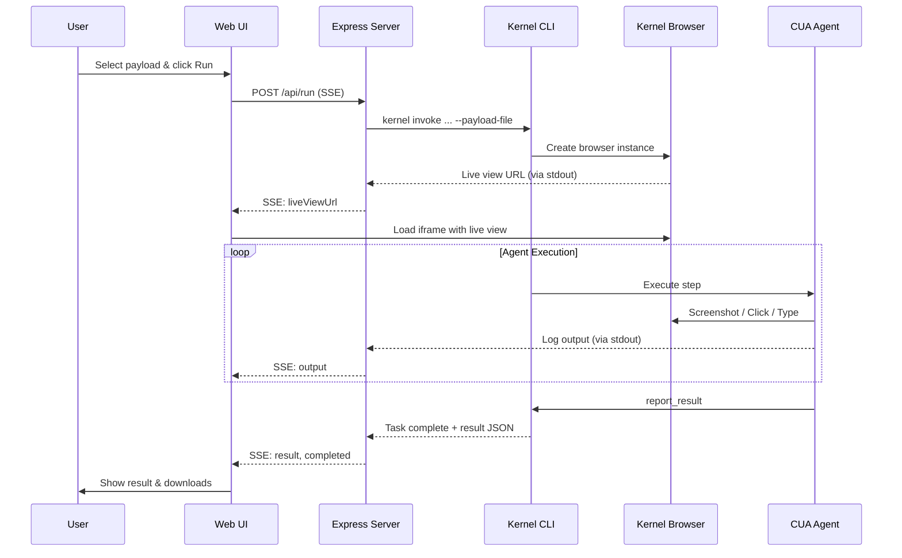

# CUA Playground - Web UI

A development interface for testing and debugging browser automation tasks. Provides real-time monitoring, live browser view, and session replay.

## Features

- **Payload Editor**: Select and modify task payloads before running
- **Live Browser View**: Watch the browser in real-time as the agent works
- **Streaming Logs**: See agent reasoning and actions as they happen
- **Session History**: Browse past runs with recordings and downloaded files
- **Replay Viewer**: Watch session recordings to debug issues

## Quick Start

```bash
cd web
node server.js
# Open http://localhost:3001
```

## Interface Layout



## Configurable Fields

The web UI allows you to modify several payload parameters before running:

| Field | Description |
|-------|-------------|
| **Target URL** | Starting URL for the browser |
| **Group Number** | Task-specific variable (substituted into instructions) |
| **Month / Year** | Invoice date parameters |
| **Max Steps** | Maximum agent actions before timeout (10-200). Higher values allow more complex tasks but risk runaway agents |
| **CUA Model** | Main agent model for screenshots and orchestration (default: Gemini 2.5 Computer Use) |
| **Stagehand Model** | Model for DOM operations like login and forms (default: Gemini 2.5 Flash) |
| **Proxy** | Bot detection avoidance: mobile, residential, ISP, or datacenter |
| **Proxy Location** | Country for the proxy IP |
| **Session Profile** | Persistent browser profile to reuse cookies/sessions |
| **Credentials** | Username, password, TOTP secret (expandable section) |

Changes made in the UI override the values stored in the payload file for that run.

## How It Works

1. **Load Payload**: Select a JSON file from `payloads/` directory
2. **Edit (optional)**: Modify variables, maxSteps, proxy settings in the UI (credentials are masked)
3. **Run**: Click "Run Task" to invoke the Kernel action
4. **Monitor**: Watch the live browser view and streaming logs
5. **Review**: Check results, download files, watch replay



## API Endpoints

### GET /api/payloads
Lists all available payload files from `payloads/` directory.

### GET /api/payload/:name
Returns a specific payload with sensitive fields masked.

### POST /api/run
Starts a task execution with Server-Sent Events (SSE) for streaming.

**Events**:
- `started` - Task invocation began
- `output` - Log line from agent
- `liveViewUrl` - Browser live view URL ready
- `result` - Final task result
- `completed` - Execution finished

### GET /api/sessions
Lists all past sessions with metadata.

### GET /api/sessions/:id/files
Lists downloadable files from a session.

### GET /api/sessions/:id/files/:filename
Downloads a file from a session.

### GET /api/sessions/:id/replay
Returns replay video URL for a session.

## File Structure

```
web/
├── server.js           # Express server with API routes
├── public/
│   ├── index.html      # Main page structure
│   ├── app.js          # Frontend JavaScript
│   └── styles.css      # Styling
└── results/            # Session data (created at runtime)
    └── <session-id>/
        ├── metadata.json    # Run info, result, timing
        ├── output.log       # Full execution log
        └── *.pdf            # Downloaded files
```

## Configuration

The server reads from the root `.env` file:

```env
KERNEL_API_KEY=...    # Required for file downloads and replay
PORT=3001             # Optional, defaults to 3001
```

## Session Storage

Each run creates a session directory in `web/results/`:

```
results/abc123xyz/
├── metadata.json     # {"payloadName": "...", "result": {...}, "startTime": "..."}
├── output.log        # Complete execution log
└── invoice.pdf       # Any downloaded files
```

Sessions are preserved for debugging and can be browsed via the UI.

## Troubleshooting

**Live view shows "Waiting for browser..."**
- Check that the log regex matches the live view URL format
- Browser may have already closed if task finished quickly

**No files downloaded**
- Check KERNEL_API_KEY is set
- Verify the task reported success with a file path

**Replay not loading**
- Recordings take a few seconds to process after task ends
- Check Kernel dashboard for replay status
