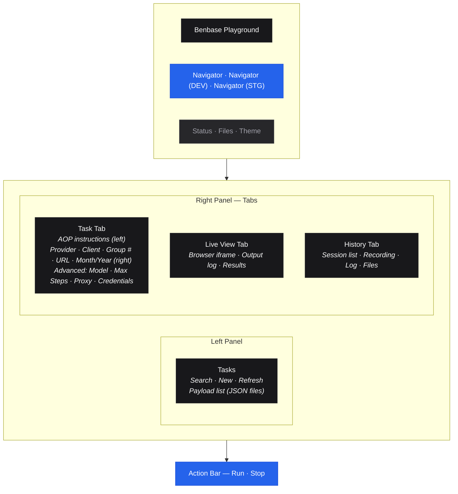
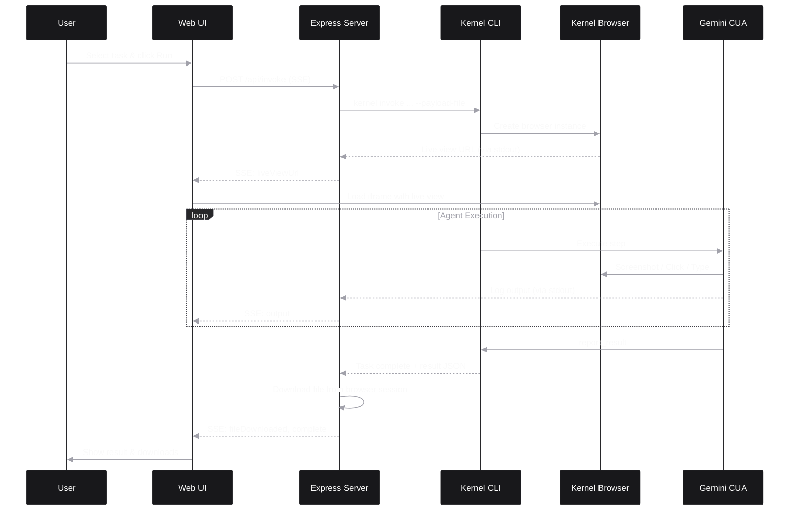

# Benbase Playground

Development interface for testing and debugging browser automation tasks. Provides real-time monitoring, live browser view, and session replay.

## Features

- **Payload Editor**: Select and modify task payloads before running
- **Live Browser View**: Watch the browser in real-time as the agent works
- **Streaming Logs**: See agent reasoning and actions as they happen
- **Session History**: Browse past runs with recordings and downloaded files
- **Replay Viewer**: Watch session recordings to debug issues

## Quick Start

```bash
cd web
node server.js
# Open http://localhost:3001
```

## Interface Layout



## Configurable Fields

The Task tab has two columns: AOP instructions on the left, and config fields on the right.

**Main fields:**

| Field | Description |
|-------|-------------|
| **AOP** | Agent Operating Procedure — step-by-step instructions for the agent (uses default master prompt if empty) |
| **Provider** | Insurance carrier or BenAdmin platform (auto-fills URL and credentials) |
| **Client** | Client/group name |
| **Group #** | Group number |
| **URL** | Starting URL for the browser (auto-filled from provider) |
| **Month / Year** | Invoice date parameters |

**Advanced settings** (collapsed by default):

| Field | Description |
|-------|-------------|
| **Navigation Model** | Gemini model for screenshots and orchestration (default: Gemini 2.5 Computer Use) |
| **Max Steps** | Maximum agent actions before timeout (10-200) |
| **Proxy** | Bot detection avoidance: mobile, residential, ISP, or datacenter |
| **Proxy Location** | Country for the proxy IP |
| **Credentials** | Username, password, TOTP secret (override provider defaults) |

Changes made in the UI override the values stored in the payload file for that run.

## How It Works

1. **Select Task**: Pick a task from the left panel (payload JSON files)
2. **Configure**: Edit AOP instructions, provider, variables, and advanced settings
3. **Run**: Click Run in the action bar — auto-switches to Live View tab
4. **Monitor**: Watch the live browser iframe and streaming output log
5. **Review**: Check results, download files, watch session recording in History tab



## API Endpoints

### Payloads

| Method | Path | Description |
|--------|------|-------------|
| GET | `/api/payloads?app=navigator` | List payload files (app-specific + shared) |
| GET | `/api/payloads/:name?app=navigator` | Get a payload with sensitive fields masked |
| POST | `/api/payloads` | Save or update a payload |

### Carriers & Credentials

| Method | Path | Description |
|--------|------|-------------|
| GET | `/api/carriers` | List all carriers and BenAdmin platforms |
| GET | `/api/carriers/:name` | Get carrier config (credentials masked) |

### Master Prompt

| Method | Path | Description |
|--------|------|-------------|
| GET | `/api/master-prompt` | Get the default instruction template |
| PUT | `/api/master-prompt` | Update the default instruction template |

### Task Execution

| Method | Path | Description |
|--------|------|-------------|
| POST | `/api/invoke` | Run a task with SSE streaming |

**SSE Events**:
- `started` - Task invocation began
- `output` - Log line from agent (stdout/stderr)
- `liveViewUrl` - Browser live view URL ready
- `fileDownloaded` - File downloaded from browser session
- `historySaved` - Session data persisted
- `complete` - Execution finished with result

### Sessions

| Method | Path | Description |
|--------|------|-------------|
| GET | `/api/sessions?app=navigator` | List all past sessions |
| GET | `/api/sessions/:id?app=navigator` | Get session details |
| GET | `/api/sessions/:id/recording?app=navigator` | Get session recording (MP4) |
| GET | `/api/sessions/:id/log?app=navigator` | Get session log (text) |
| GET | `/api/sessions/:id/files/:filename?app=navigator` | Download a file from a session |

## File Structure

```
web/
├── server.js           # Express server with API routes
├── public/
│   ├── index.html      # Main page structure
│   ├── app.js          # Frontend JavaScript
│   └── styles.css      # Styling
└── results/            # Session data (created at runtime)
    └── <app>/
        └── <session-id>/
            ├── metadata.json    # Run info, result, timing
            ├── log.txt          # Full execution log
            ├── recording.mp4   # Session recording (if available)
            └── *.pdf            # Downloaded files
```

## Configuration

The server reads from the root `.env` file:

```env
KERNEL_API_KEY=...    # Required for file downloads and replay
PORT=3001             # Optional, defaults to 3001
```

## Session Storage

Each run creates a session directory in `web/results/<app>/`:

```
results/navigator/abc123xyz/
├── metadata.json     # {"sessionId", "app", "payloadName", "result", "timestamp", ...}
├── log.txt           # Complete execution log
├── recording.mp4     # Session recording (if available)
└── invoice.pdf       # Any downloaded files
```

Sessions are organized by app and preserved for debugging. Browse them via the History tab in the UI.

## Troubleshooting

**Live view shows "Waiting for browser..."**
- Check that the log regex matches the live view URL format
- Browser may have already closed if task finished quickly

**No files downloaded**
- Check `KERNEL_API_KEY` is set
- Verify the task reported success with a file path

**Replay not loading**
- Recordings take a few seconds to process after task ends
- Check Kernel dashboard for replay status
